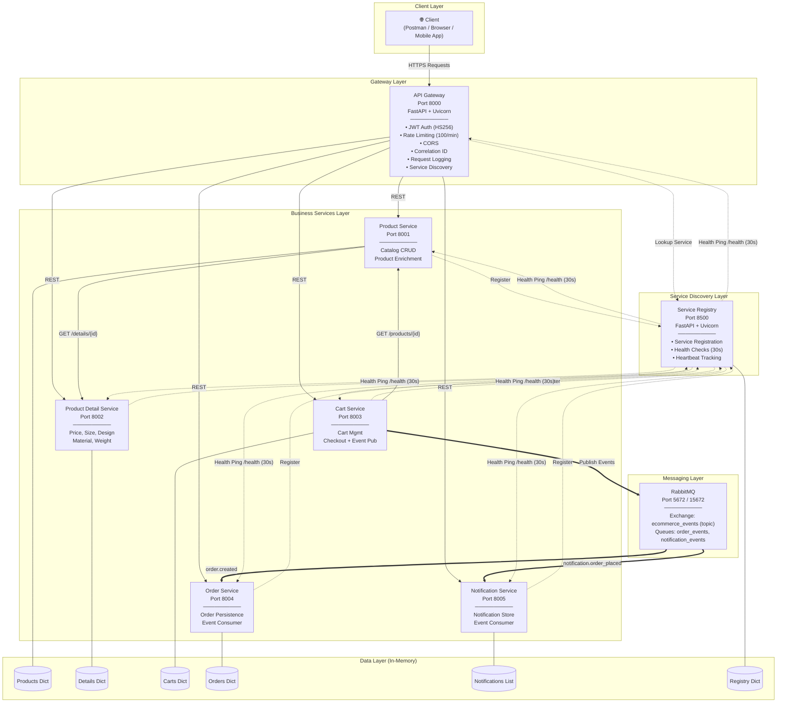
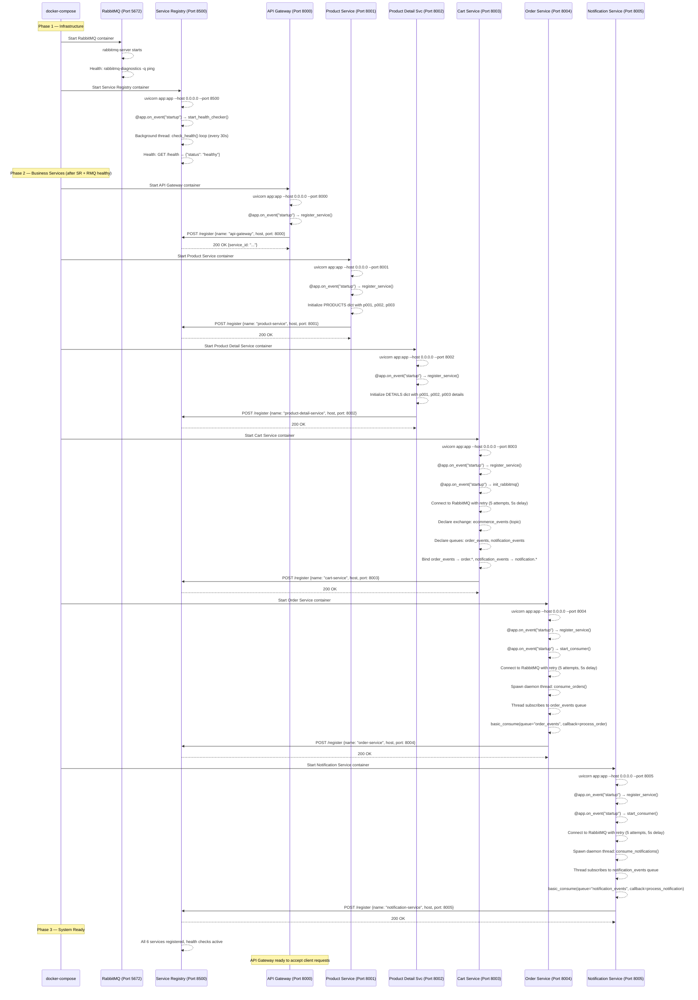
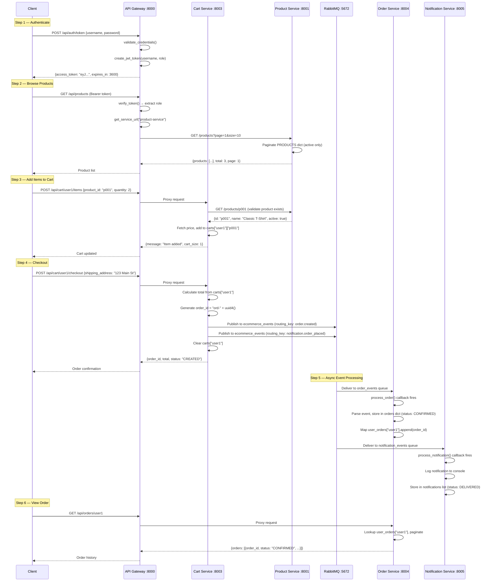

# Architecture Diagram — E-Commerce Microservices Platform

## High-Level Architecture



---

## Application Startup Sequence

When you run `docker-compose up`, here is the **exact order** in which services start and the **methods that execute** at each step.

### Step-by-Step Startup Flow



---

### Detailed Startup Instructions

#### Phase 1: Infrastructure Services

**1. RabbitMQ (Message Broker)**

```
Container: rabbitmq
Image: rabbitmq:3-management
Ports: 5672 (AMQP), 15672 (Management UI)
Health Check: rabbitmq-diagnostics -q ping (every 10s)
```

- Docker Compose starts RabbitMQ first
- Broker initializes, management plugin loads
- Health check confirms broker is ready before dependent services start

**2. Service Registry (Port 8500)**

```
Container: service-registry
Entry Point: uvicorn app:app --host 0.0.0.0 --port 8500
Depends On: Nothing (first app service)
```

**Startup method execution order:**
1. `uvicorn` starts the ASGI server, loads `app:app` (FastAPI instance)
2. FastAPI triggers `@app.on_event("startup")` → calls `start_health_checker()`
3. `start_health_checker()` spawns a **daemon background thread** running `check_health()`
4. `check_health()` runs in an infinite loop:
   - Sleeps for 30 seconds
   - Iterates over all registered services
   - Sends `GET /health` to each service
   - Sets `status = "DOWN"` if the health check fails
   - Updates `last_heartbeat` on success
5. Service Registry is now ready to accept registrations at `POST /register`

---

#### Phase 2: Application Services (start after Registry + RabbitMQ are healthy)

**3. API Gateway (Port 8000)**

```
Container: api-gateway
Entry Point: uvicorn app:app --host 0.0.0.0 --port 8000
Depends On: service-registry (healthy)
```

**Startup method execution order:**
1. `uvicorn` starts, loads `app:app`
2. Module-level initialization:
   - `USERS` dict initialized with 3 hardcoded users (admin, user1, user2)
   - `SECRET_KEY` set for JWT signing
   - `rate_limiter` dict initialized (empty)
   - `service_cache` dict initialized (empty, 30s TTL)
3. FastAPI triggers `@app.on_event("startup")` → calls `register_service()`
4. `register_service()` sends `POST http://service-registry:8500/register` with:
   ```json
   {"name": "api-gateway", "host": "api-gateway", "port": 8000}
   ```
5. Middleware stack is active:
   - `correlation_id_middleware` → generates `X-Correlation-ID` for every request
   - `logging_middleware` → logs method, path, status, duration
6. Gateway is ready to proxy requests. For each incoming request:
   - Rate limit check (100 req/min per IP)
   - JWT verification (except public endpoints)
   - Role-based access check
   - Service discovery (query registry or use DNS fallback)
   - Proxy to downstream service with correlation ID header

**4. Product Service (Port 8001)**

```
Container: product-service
Entry Point: uvicorn app:app --host 0.0.0.0 --port 8001
Depends On: service-registry (healthy)
```

**Startup method execution order:**
1. `uvicorn` starts, loads `app:app`
2. Module-level initialization:
   - `PRODUCTS` dict pre-seeded with 3 products:
     - `p001`: Classic T-Shirt (Apparel)
     - `p002`: Running Shoes (Footwear)
     - `p003`: Leather Wallet (Accessories)
3. `@app.on_event("startup")` → `register_service()`
4. Registers with Service Registry as `"product-service"` on port 8001
5. Ready to serve product CRUD requests and enrich responses via Product Detail Service

**5. Product Detail Service (Port 8002)**

```
Container: product-detail-service
Entry Point: uvicorn app:app --host 0.0.0.0 --port 8002
Depends On: service-registry (healthy)
```

**Startup method execution order:**
1. `uvicorn` starts, loads `app:app`
2. Module-level initialization:
   - `DETAILS` dict pre-seeded with details for p001, p002, p003:
     - Includes sizes, price, currency, design, material, weight
3. `@app.on_event("startup")` → `register_service()`
4. Registers with Service Registry as `"product-detail-service"` on port 8002
5. Ready to serve detail lookups and price queries

**6. Cart Service (Port 8003)**

```
Container: cart-service
Entry Point: uvicorn app:app --host 0.0.0.0 --port 8003
Depends On: service-registry (healthy), rabbitmq (healthy)
```

**Startup method execution order:**
1. `uvicorn` starts, loads `app:app`
2. Module-level initialization:
   - `carts` dict initialized (empty — carts created on demand)
   - `rabbitmq_connection` and `rabbitmq_channel` set to `None`
3. `@app.on_event("startup")` → `register_service()` — registers with Service Registry
4. `@app.on_event("startup")` → `init_rabbitmq()`:
   - **Retry loop**: Attempts RabbitMQ connection up to 5 times with 5-second delays
   - `pika.BlockingConnection(pika.ConnectionParameters(host='rabbitmq'))` — opens AMQP connection
   - `connection.channel()` — creates a channel
   - `channel.exchange_declare(exchange='ecommerce_events', exchange_type='topic')` — declares the topic exchange
   - `channel.queue_declare(queue='order_events')` — declares the order events queue
   - `channel.queue_declare(queue='notification_events')` — declares the notification events queue
   - `channel.queue_bind(exchange='ecommerce_events', queue='order_events', routing_key='order.*')` — binds order queue
   - `channel.queue_bind(exchange='ecommerce_events', queue='notification_events', routing_key='notification.*')` — binds notification queue
5. Cart Service is ready. On checkout:
   - Publishes to `ecommerce_events` exchange with routing key `order.created`
   - Publishes to `ecommerce_events` exchange with routing key `notification.order_placed`

**7. Order Service (Port 8004)**

```
Container: order-service
Entry Point: uvicorn app:app --host 0.0.0.0 --port 8004
Depends On: service-registry (healthy), rabbitmq (healthy)
```

**Startup method execution order:**
1. `uvicorn` starts, loads `app:app`
2. Module-level initialization:
   - `orders` dict initialized (empty)
   - `user_orders` dict initialized (empty — maps user_id to list of order_ids)
3. `@app.on_event("startup")` → `register_service()` — registers with Service Registry
4. `@app.on_event("startup")` → `start_consumer()`:
   - **Retry loop**: Connect to RabbitMQ (5 attempts, 5-second delay between retries)
   - `pika.BlockingConnection(...)` — opens connection
   - `connection.channel()` — creates channel
   - `channel.queue_declare(queue='order_events')` — ensures queue exists
   - Spawns a **daemon thread** running `consume_orders()`:
     ```python
     thread = threading.Thread(target=consume_orders, daemon=True)
     thread.start()
     ```
   - Inside `consume_orders()`:
     - `channel.basic_consume(queue='order_events', on_message_callback=process_order, auto_ack=True)`
     - `channel.start_consuming()` — **blocks the thread**, waiting for messages
   - `process_order(ch, method, properties, body)` callback:
     - Parses JSON body
     - Extracts: order_id, user_id, items, total, shipping_address, correlation_id
     - Stores order in `orders` dict with `status = "CONFIRMED"`
     - Appends order_id to `user_orders[user_id]`
5. Order Service API is ready for queries while consumer thread processes events in background

**8. Notification Service (Port 8005)**

```
Container: notification-service
Entry Point: uvicorn app:app --host 0.0.0.0 --port 8005
Depends On: service-registry (healthy), rabbitmq (healthy)
```

**Startup method execution order:**
1. `uvicorn` starts, loads `app:app`
2. Module-level initialization:
   - `notifications` list initialized (empty)
3. `@app.on_event("startup")` → `register_service()` — registers with Service Registry
4. `@app.on_event("startup")` → `start_consumer()`:
   - **Retry loop**: Connect to RabbitMQ (5 attempts, 5-second delay between retries)
   - `pika.BlockingConnection(...)` — opens connection
   - `connection.channel()` — creates channel
   - `channel.queue_declare(queue='notification_events')` — ensures queue exists
   - Spawns a **daemon thread** running `consume_notifications()`:
     ```python
     thread = threading.Thread(target=consume_notifications, daemon=True)
     thread.start()
     ```
   - Inside `consume_notifications()`:
     - `channel.basic_consume(queue='notification_events', on_message_callback=process_notification, auto_ack=True)`
     - `channel.start_consuming()` — **blocks the thread**, waiting for messages
   - `process_notification(ch, method, properties, body)` callback:
     - Parses JSON body
     - Extracts: event_type, user_id, message, order_id, correlation_id
     - Logs notification with formatted console output
     - Appends notification to `notifications` list with `status = "DELIVERED"`
5. Notification Service API is ready for queries while consumer thread processes events in background

---

### Phase 3: System Ready — Health Check Loop Active

Once all services are registered, the Service Registry's **health check background thread** begins pinging all services every 30 seconds:

```
Service Registry check_health() loop:
  → GET http://api-gateway:8000/health
  → GET http://product-service:8001/health
  → GET http://product-detail-service:8002/health
  → GET http://cart-service:8003/health
  → GET http://order-service:8004/health
  → GET http://notification-service:8005/health
```

If any service fails to respond, its status is set to `DOWN` in the registry.

---

## Running the Application

### Prerequisites
- Docker and Docker Compose installed
- Ports 5672, 8000–8005, 15672 available

### Start All Services
```bash
docker-compose up --build
```

### What Happens on `docker-compose up`

| Step | What Starts | Method Executed First | What It Does |
|------|-------------|----------------------|--------------|
| 1 | RabbitMQ | `rabbitmq-server` | Broker starts, management plugin loads |
| 2 | Service Registry | `uvicorn` → `@startup` → `start_health_checker()` | Launches health check thread |
| 3 | API Gateway | `uvicorn` → `@startup` → `register_service()` | Registers with registry, middleware stack active |
| 4 | Product Service | `uvicorn` → `@startup` → `register_service()` | Seeds 3 products, registers |
| 5 | Product Detail Service | `uvicorn` → `@startup` → `register_service()` | Seeds 3 detail records, registers |
| 6 | Cart Service | `uvicorn` → `@startup` → `register_service()` + `init_rabbitmq()` | Registers, connects to RabbitMQ, declares exchange & queues |
| 7 | Order Service | `uvicorn` → `@startup` → `register_service()` + `start_consumer()` | Registers, spawns consumer daemon thread |
| 8 | Notification Service | `uvicorn` → `@startup` → `register_service()` + `start_consumer()` | Registers, spawns consumer daemon thread |

### Verify All Services Are Running
```bash
curl http://localhost:8500/services
```
Expected: All 6 services listed with `status: "UP"`

### Stop All Services
```bash
docker-compose down
```

---

## Request flow — Complete Checkout Example

This shows every method call from the moment a user checks out:



---

## Communication Patterns Summary

| Pattern | Source | → | Destination | Mechanism |
|---------|--------|---|-------------|-----------|
| **Synchronous REST** | Client | → | API Gateway | HTTP/JSON |
| **Synchronous REST** | API Gateway | → | All Services | HTTP/JSON (proxied) |
| **Synchronous REST** | Product Service | → | Product Detail Service | HTTP/JSON (enrichment) |
| **Synchronous REST** | Cart Service | → | Product Service | HTTP/JSON (validation) |
| **Async Messaging** | Cart Service | → | Order Service | RabbitMQ (order.created) |
| **Async Messaging** | Cart Service | → | Notification Service | RabbitMQ (notification.order_placed) |
| **Service Discovery** | All Services | → | Service Registry | HTTP/JSON (registration) |
| **Health Monitoring** | Service Registry | → | All Services | HTTP/JSON (GET /health every 30s) |

---

## Technology Stack

| Layer | Technology |
|-------|-----------|
| Language | Python 3.11+ |
| Web Framework | FastAPI |
| ASGI Server | Uvicorn |
| Message Broker | RabbitMQ 3 (with Management Plugin) |
| RabbitMQ Client | Pika |
| HTTP Client | httpx (async) |
| Authentication | PyJWT (HS256) |
| Containerization | Docker + Docker Compose |
| Networking | Docker bridge network (`ecommerce-net`) |
| Data Storage | In-memory (Python dicts/lists) |
