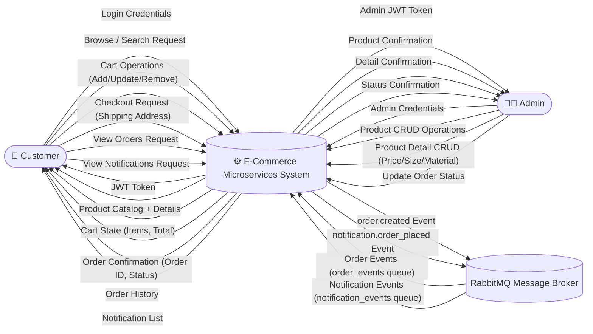
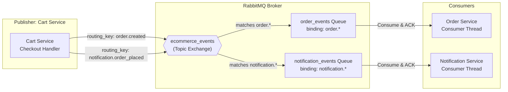

# Data Flow Diagrams — E-Commerce Microservices Platform

## Notation Guide

| Symbol | Meaning |
|--------|---------|
| Rectangle | External Entity (actor) |
| Rounded Rectangle / Circle | Process |
| Open Rectangle (parallel lines) | Data Store |
| Arrow | Data Flow (labeled) |

---

## DFD Level 0 — Context Diagram

The Level 0 DFD shows the entire E-Commerce system as a single process and all external entities interacting with it.



### Level 0 — Data Flow Summary

| # | Source | → | Destination | Data Flow |
|---|--------|---|-------------|-----------|
| D1 | Customer | → | System | Login credentials (username, password) |
| D2 | System | → | Customer | JWT access token |
| D3 | Customer | → | System | Product browse/search request (pagination) |
| D4 | System | → | Customer | Product catalog with details |
| D5 | Customer | → | System | Cart operations (add, update, remove items) |
| D6 | System | → | Customer | Cart state (items, count, total) |
| D7 | Customer | → | System | Checkout request with shipping address |
| D8 | System | → | Customer | Order confirmation (order_id, status) |
| D9 | Customer | → | System | View orders request |
| D10 | System | → | Customer | Order history (paginated) |
| D11 | Admin | → | System | Product CRUD data |
| D12 | System | → | Admin | CRUD confirmation |
| D13 | System | → | RabbitMQ | Async events (order.created, notification.order_placed) |
| D14 | RabbitMQ | → | System | Consumed events for processing |

---

## DFD Level 2 — Detailed Process Decomposition

Level 2 decomposes the system into individual microservice processes, internal data stores, and all inter-service data flows.

```mermaid
graph TB
    %% External Entities
    Customer([👤 Customer])
    Admin([🧑‍💼 Admin])

    %% Processes
    P1["P1: API Gateway<br/>(Port 8000)<br/>Auth, Routing, Rate Limiting"]
    P2["P2: Service Registry<br/>(Port 8500)<br/>Discovery & Health Checks"]
    P3["P3: Product Service<br/>(Port 8001)<br/>Product Catalog CRUD"]
    P4["P4: Product Detail Service<br/>(Port 8002)<br/>Price, Size, Material"]
    P5["P5: Cart Service<br/>(Port 8003)<br/>Cart Management & Checkout"]
    P6["P6: Order Service<br/>(Port 8004)<br/>Order Persistence & Queries"]
    P7["P7: Notification Service<br/>(Port 8005)<br/>Event-Driven Notifications"]

    %% Data Stores
    DS1[("DS1: Service Registry Store<br/>(In-Memory Dict)")]
    DS2[("DS2: Product Store<br/>(In-Memory Dict)")]
    DS3[("DS3: Product Detail Store<br/>(In-Memory Dict)")]
    DS4[("DS4: Cart Store<br/>(In-Memory Dict per User)")]
    DS5[("DS5: Order Store<br/>(In-Memory Dict)")]
    DS6[("DS6: Notification Store<br/>(In-Memory List)")]
    DS7[("DS7: Rate Limit Store<br/>(In-Memory per IP)")]

    %% Message Broker
    MQ{{"RabbitMQ<br/>ecommerce_events Exchange<br/>(Topic)"}}

    %% === Customer Flows ===
    Customer -->|"1. POST /api/auth/token<br/>(username, password)"| P1
    P1 -->|"2. JWT Token Response"| Customer

    Customer -->|"3. GET /api/products<br/>(page, size)"| P1
    P1 -->|"4. Route to Product Service"| P3
    P3 -->|"5. Product List"| P1
    P1 -->|"6. Product Catalog"| Customer

    Customer -->|"7. GET /api/products/{id}?enrich=true"| P1
    P1 -->|"8. Proxy Request"| P3
    P3 -->|"9. GET /details/{id}"| P4
    P4 -->|"10. Price, Sizes, Material, Design"| P3
    P3 -->|"11. Enriched Product"| P1
    P1 -->|"12. Full Product Info"| Customer

    Customer -->|"13. POST /api/cart/{user}/items<br/>(product_id, qty)"| P1
    P1 -->|"14. Proxy to Cart Service"| P5
    P5 -->|"15. GET /products/{id}<br/>(Validate Product)"| P3
    P3 -->|"16. Product Data + Active Status"| P5
    P5 -->|"17. Cart Updated"| P1
    P1 -->|"18. Cart Confirmation"| Customer

    Customer -->|"19. POST /api/cart/{user}/checkout<br/>(shipping_address)"| P1
    P1 -->|"20. Proxy to Cart Service"| P5
    P5 -->|"21. Publish order.created"| MQ
    P5 -->|"22. Publish notification.order_placed"| MQ
    MQ -->|"23. Consume order_events queue"| P6
    MQ -->|"24. Consume notification_events queue"| P7
    P5 -->|"25. Order Confirmation"| P1
    P1 -->|"26. Order ID + Status"| Customer

    Customer -->|"27. GET /api/orders/{user}"| P1
    P1 -->|"28. Proxy to Order Service"| P6
    P6 -->|"29. Paginated Orders"| P1
    P1 -->|"30. Order History"| Customer

    Customer -->|"31. GET /api/notifications"| P1
    P1 -->|"32. Proxy to Notification Svc"| P7
    P7 -->|"33. Notification List"| P1
    P1 -->|"34. Notifications"| Customer

    %% === Admin Flows ===
    Admin -->|"35. POST/PUT/DELETE /api/products"| P1
    P1 -->|"36. Verify Admin Role + Proxy"| P3

    Admin -->|"37. POST/PUT/DELETE /api/product-details"| P1
    P1 -->|"38. Verify Admin Role + Proxy"| P4

    Admin -->|"39. PUT /api/orders/{id}/status"| P1
    P1 -->|"40. Proxy to Order Service"| P6

    %% === Data Store Connections ===
    P2 --- DS1
    P3 --- DS2
    P4 --- DS3
    P5 --- DS4
    P6 --- DS5
    P7 --- DS6
    P1 --- DS7

    %% === Service Registration ===
    P1 -.->|"Register on startup"| P2
    P3 -.->|"Register on startup"| P2
    P4 -.->|"Register on startup"| P2
    P5 -.->|"Register on startup"| P2
    P6 -.->|"Register on startup"| P2
    P7 -.->|"Register on startup"| P2

    P1 -.->|"Query service location"| P2

    %% === Health Check ===
    P2 -.->|"Ping /health every 30s"| P1
    P2 -.->|"Ping /health every 30s"| P3
    P2 -.->|"Ping /health every 30s"| P4
    P2 -.->|"Ping /health every 30s"| P5
    P2 -.->|"Ping /health every 30s"| P6
    P2 -.->|"Ping /health every 30s"| P7
```



---

### Level 2 — Process Descriptions

#### P1: API Gateway (Port 8000)
| Input | Process | Output |
|-------|---------|--------|
| Username + Password | Validate credentials, generate JWT (HS256, 60 min) | JWT Token |
| Any API request | Check rate limit (100 req/min per IP), attach Correlation ID, verify JWT, check role, resolve service from registry, proxy request | Proxied response with X-Correlation-ID and X-Response-Time headers |

#### P2: Service Registry (Port 8500)
| Input | Process | Output |
|-------|---------|--------|
| Service registration (name, host, port) | Store in registry with timestamp, set status=UP | Registration confirmation |
| Health check timer (every 30s) | Ping each service's `/health` endpoint | Update service status (UP/DOWN) |
| Service lookup query | Find matching service with status=UP | Service host and port |

#### P3: Product Service (Port 8001)
| Input | Process | Output |
|-------|---------|--------|
| GET /products (page, size) | Paginate active products from DS2 | Product list with pagination metadata |
| GET /products/{id}?enrich=true | Fetch product from DS2, call P4 for details | Enriched product with price/size/material |
| POST /products (name, category) | Generate UUID, store in DS2 | Created product |

#### P4: Product Detail Service (Port 8002)
| Input | Process | Output |
|-------|---------|--------|
| GET /details/{product_id} | Lookup from DS3 | Product details (sizes, price, currency, design, material, weight) |
| POST /details/{product_id} | Store/replace in DS3 | Confirmation |

#### P5: Cart Service (Port 8003)
| Input | Process | Output |
|-------|---------|--------|
| POST /cart/{user}/items (product_id, qty) | Validate product via P3, fetch price, add to DS4 | Updated cart |
| POST /cart/{user}/checkout (address) | Calculate total, generate order ID, publish events to MQ, clear DS4 | Order ID + status=CREATED |

#### P6: Order Service (Port 8004)
| Input | Process | Output |
|-------|---------|--------|
| order.created event from MQ | Parse event, store order in DS5 with status=CONFIRMED | — (async) |
| GET /orders/{user_id} | Query DS5, paginate | Order list |

#### P7: Notification Service (Port 8005)
| Input | Process | Output |
|-------|---------|--------|
| notification.order_placed event from MQ | Parse event, log to console, store in DS6 with status=DELIVERED | — (async) |
| GET /notifications | Query DS6, filter by user_id | Notification list |

---

### Level 2 — Data Store Contents

| Store | Structure | Key Fields |
|-------|-----------|------------|
| DS1: Service Registry | `Dict[service_id → service_info]` | name, host, port, status, last_heartbeat |
| DS2: Product Store | `Dict[product_id → product]` | id, name, category, active |
| DS3: Product Detail Store | `Dict[product_id → details]` | product_id, sizes, price, currency, design, material, weight |
| DS4: Cart Store | `Dict[user_id → Dict[product_id → item]]` | product_id, quantity, product_name, price |
| DS5: Order Store | `Dict[order_id → order]` + `Dict[user_id → List[order_id]]` | order_id, user_id, items, total, shipping_address, status, created_at |
| DS6: Notification Store | `List[notification]` | id, event_type, user_id, message, order_id, correlation_id, received_at, status |
| DS7: Rate Limit Store | `Dict[IP → List[timestamps]]` | IP address, request timestamps within window |

---

### Level 2 — RabbitMQ Message Flow Detail



#### Event: `order.created`
```json
{
  "event_type": "order.created",
  "order_id": "ord-xxxxxxxx",
  "user_id": "user1",
  "items": [
    {"product_id": "p001", "quantity": 2, "product_name": "Classic T-Shirt", "price": 29.99}
  ],
  "total": 59.98,
  "shipping_address": "123 Main St",
  "correlation_id": "corr-xxxxxxxx",
  "created_at": "2026-04-09T10:30:00"
}
```

#### Event: `notification.order_placed`
```json
{
  "event_type": "notification.order_placed",
  "user_id": "user1",
  "order_id": "ord-xxxxxxxx",
  "message": "Order ord-xxxxxxxx placed successfully. Total: $59.98",
  "correlation_id": "corr-xxxxxxxx"
}
```
