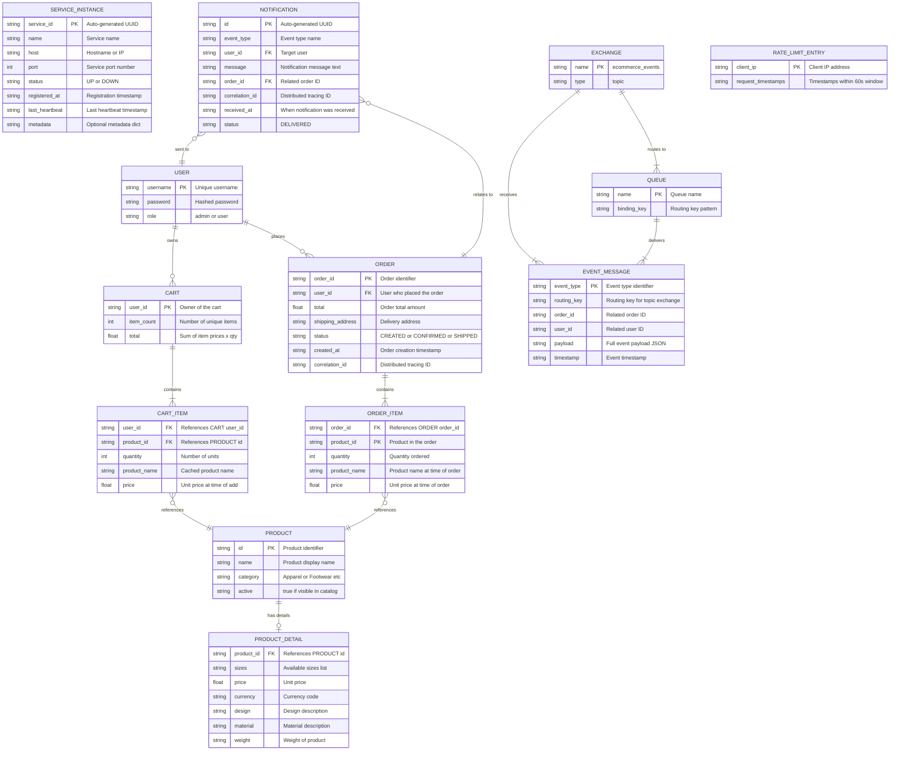

# ER Diagram — E-Commerce Microservices Platform

## Overview

Each microservice owns its independent data store (Database-per-Service pattern). Currently all stores are **in-memory dictionaries** but are designed for migration to persistent databases. This ER diagram documents all entities, their attributes, and relationships across the system.

---

## Complete ER Diagram (Mermaid)

---

## Entity Descriptions

### Service Registry Domain

| Entity | Store Location | Description |
|--------|---------------|-------------|
| **SERVICE_INSTANCE** | Service Registry (Port 8500) | Tracks all registered microservice instances with health status. Updated by heartbeats and periodic health checks. |

### Product Domain

| Entity | Store Location | Description |
|--------|---------------|-------------|
| **PRODUCT** | Product Service (Port 8001) | Core product catalog entry with name, category, and active flag. Pre-seeded with 3 sample products (p001, p002, p003). |
| **PRODUCT_DETAIL** | Product Detail Service (Port 8002) | Extended metadata for a product including pricing, available sizes, design, material, and weight. One-to-one with PRODUCT. |

### Cart Domain

| Entity | Store Location | Description |
|--------|---------------|-------------|
| **CART** | Cart Service (Port 8003) | Virtual entity representing a user's shopping cart. Created on first item add, destroyed on checkout. |
| **CART_ITEM** | Cart Service (Port 8003) | Individual line item in a cart. Caches product_name and price at add time to avoid repeated lookups. |

### Order Domain

| Entity | Store Location | Description |
|--------|---------------|-------------|
| **ORDER** | Order Service (Port 8004) | Represents a completed checkout. Created asynchronously via RabbitMQ event consumption. Tracks status lifecycle: CREATED → CONFIRMED → SHIPPED → DELIVERED. |
| **ORDER_ITEM** | Order Service (Port 8004) | Snapshot of a purchased item. Preserves the price and product name at time of purchase (immutable). |

### User Domain

| Entity | Store Location | Description |
|--------|---------------|-------------|
| **USER** | API Gateway (Port 8000) | Hardcoded user records used for JWT authentication. Three users: admin (admin role), user1 and user2 (user role). |

### Notification Domain

| Entity | Store Location | Description |
|--------|---------------|-------------|
| **NOTIFICATION** | Notification Service (Port 8005) | Event-driven notification record. Created when async events are consumed from RabbitMQ. Stores full event context for audit trail. |

### Messaging Domain

| Entity | Store Location | Description |
|--------|---------------|-------------|
| **EXCHANGE** | RabbitMQ | Topic exchange `ecommerce_events` that routes messages based on routing keys. |
| **QUEUE** | RabbitMQ | Named queues with pattern-based bindings: `order_events` (order.*) and `notification_events` (notification.*). |
| **EVENT_MESSAGE** | RabbitMQ (transient) | JSON messages flowing through the exchange. Published by Cart Service, consumed by Order and Notification services. |

---

## Relationships Summary

| Relationship | Cardinality | Description |
|-------------|-------------|-------------|
| PRODUCT → PRODUCT_DETAIL | 1 : 0..1 | A product may have zero or one detail record |
| CART → CART_ITEM | 1 : 1..* | A cart contains one or more items |
| CART_ITEM → PRODUCT | * : 1 | Each cart item references one product |
| USER → CART | 1 : 0..* | A user can have zero or one active cart |
| USER → ORDER | 1 : 0..* | A user can have zero or many orders |
| ORDER → ORDER_ITEM | 1 : 1..* | An order contains one or more items |
| ORDER_ITEM → PRODUCT | * : 1 | Each order item references one product |
| NOTIFICATION → ORDER | * : 1 | Notifications reference an order |
| NOTIFICATION → USER | * : 1 | Notifications are sent to a user |
| EXCHANGE → QUEUE | 1 : * | An exchange routes to multiple queues |

---

## Sample Data (Pre-Seeded)

### Products
| ID | Name | Category | Active |
|----|------|----------|--------|
| p001 | Classic T-Shirt | Apparel | true |
| p002 | Running Shoes | Footwear | true |
| p003 | Leather Wallet | Accessories | true |

### Product Details
| Product ID | Sizes | Price | Currency | Design | Material | Weight |
|-----------|-------|-------|----------|--------|----------|--------|
| p001 | S, M, L, XL | 29.99 | USD | Solid Navy Blue | 100% Cotton | 200g |
| p002 | 8, 9, 10, 11, 12 | 89.99 | USD | Sport Black/Red | Mesh & Synthetic | 350g |
| p003 | One Size | 49.99 | USD | Classic Brown | Genuine Leather | 150g |

### Users
| Username | Role |
|----------|------|
| admin | admin |
| user1 | user |
| user2 | user |
