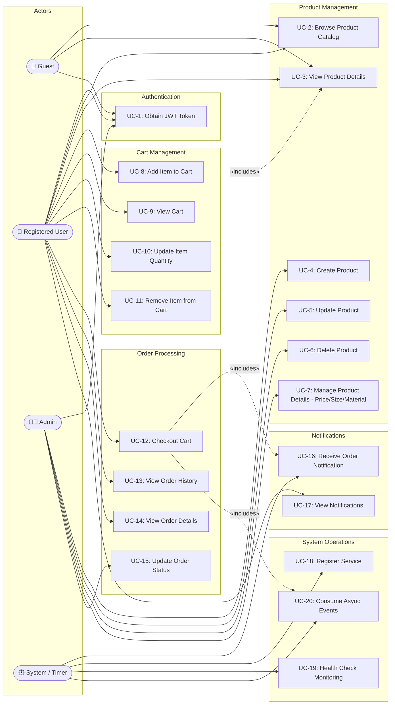

# Use Case Diagram — E-Commerce Microservices Platform

## Actors

| Actor | Description |
|-------|-------------|
| **Guest** | Unauthenticated user who can browse products |
| **Registered User** | Authenticated user who can shop, manage cart, and place orders |
| **Admin** | Privileged user who can manage products and system |
| **System (Timer)** | Background processes (health checks, message consumers) |

---

## Use Case Diagram (Mermaid)

---

## Use Case Descriptions

### UC-1: Obtain JWT Token
| Field | Description |
|-------|-------------|
| **Actor** | Guest, Registered User, Admin |
| **Precondition** | User has valid credentials (username/password) |
| **Main Flow** | 1. User sends `POST /api/auth/token` with username & password. 2. API Gateway validates credentials. 3. JWT token is generated with role claim (user/admin). 4. Token returned with 60-minute expiry. |
| **Postcondition** | User receives a JWT token for authenticated requests |

### UC-2: Browse Product Catalog
| Field | Description |
|-------|-------------|
| **Actor** | Guest, Registered User |
| **Precondition** | None |
| **Main Flow** | 1. User sends `GET /api/products`. 2. API Gateway forwards to Product Service. 3. Product Service returns paginated list of active products. |
| **Postcondition** | User sees a list of available products |

### UC-3: View Product Details
| Field | Description |
|-------|-------------|
| **Actor** | Guest, Registered User |
| **Precondition** | Product exists |
| **Main Flow** | 1. User sends `GET /api/products/{id}?enrich=true`. 2. Product Service fetches base product. 3. Product Service calls Product Detail Service for price, sizes, material info. 4. Enriched product returned. |
| **Postcondition** | User sees full product information including pricing and specifications |

### UC-4: Create Product
| Field | Description |
|-------|-------------|
| **Actor** | Admin |
| **Precondition** | Valid JWT with admin role |
| **Main Flow** | 1. Admin sends `POST /api/products` with name and category. 2. API Gateway verifies admin role. 3. Product Service creates product with auto-generated ID. |
| **Postcondition** | New product is added to the catalog |

### UC-5: Update Product
| Field | Description |
|-------|-------------|
| **Actor** | Admin |
| **Precondition** | Valid JWT, product exists |
| **Main Flow** | 1. Admin sends `PUT /api/products/{id}` with updated fields. 2. Product Service updates specified fields. |
| **Postcondition** | Product information is updated |

### UC-6: Delete Product
| Field | Description |
|-------|-------------|
| **Actor** | Admin |
| **Precondition** | Valid JWT with admin role, product exists |
| **Main Flow** | 1. Admin sends `DELETE /api/products/{id}`. 2. API Gateway verifies admin role. 3. Product Service removes product. |
| **Postcondition** | Product is removed from catalog |

### UC-7: Manage Product Details (Price / Size / Material)
| Field | Description |
|-------|-------------|
| **Actor** | Admin |
| **Precondition** | Valid JWT with admin role |
| **Main Flow** | 1. Admin sends POST/PUT/DELETE to `/api/product-details/{id}`. 2. Product Detail Service updates sizes, price, design, material, weight. |
| **Postcondition** | Product metadata is created/updated/deleted |

### UC-8: Add Item to Cart
| Field | Description |
|-------|-------------|
| **Actor** | Registered User |
| **Precondition** | Valid JWT, product exists and is active |
| **Main Flow** | 1. User sends `POST /api/cart/{user_id}/items` with product_id and quantity. 2. Cart Service validates product exists by calling Product Service. 3. Cart Service fetches price from Product Detail Service. 4. Item added to user's cart. |
| **Postcondition** | Item is present in user's cart |

### UC-9: View Cart
| Field | Description |
|-------|-------------|
| **Actor** | Registered User |
| **Precondition** | Valid JWT |
| **Main Flow** | 1. User sends `GET /api/cart/{user_id}`. 2. Cart Service returns items, item count, and total price. |
| **Postcondition** | User sees current cart contents |

### UC-10: Update Item Quantity
| Field | Description |
|-------|-------------|
| **Actor** | Registered User |
| **Precondition** | Valid JWT, item exists in cart |
| **Main Flow** | 1. User sends `PUT /api/cart/{user_id}/items/{product_id}` with new quantity. 2. Cart Service updates quantity. |
| **Postcondition** | Item quantity is updated |

### UC-11: Remove Item from Cart
| Field | Description |
|-------|-------------|
| **Actor** | Registered User |
| **Precondition** | Valid JWT, item exists in cart |
| **Main Flow** | 1. User sends `DELETE /api/cart/{user_id}/items/{product_id}`. 2. Cart Service removes item. |
| **Postcondition** | Item is removed from cart |

### UC-12: Checkout Cart
| Field | Description |
|-------|-------------|
| **Actor** | Registered User |
| **Precondition** | Valid JWT, cart is not empty |
| **Main Flow** | 1. User sends `POST /api/cart/{user_id}/checkout` with shipping_address. 2. Cart Service calculates total and generates order ID. 3. `order.created` event published to RabbitMQ. 4. `notification.order_placed` event published to RabbitMQ. 5. Cart is cleared. 6. Order ID and status returned. |
| **Postcondition** | Order is created, cart is emptied, notifications triggered |

### UC-13: View Order History
| Field | Description |
|-------|-------------|
| **Actor** | Registered User |
| **Precondition** | Valid JWT |
| **Main Flow** | 1. User sends `GET /api/orders/{user_id}`. 2. Order Service returns paginated list of orders. |
| **Postcondition** | User sees all past orders |

### UC-14: View Order Details
| Field | Description |
|-------|-------------|
| **Actor** | Registered User |
| **Precondition** | Valid JWT, order exists |
| **Main Flow** | 1. User sends `GET /api/orders/{user_id}/{order_id}`. 2. Order Service returns full order details. |
| **Postcondition** | User sees complete order information |

### UC-15: Update Order Status
| Field | Description |
|-------|-------------|
| **Actor** | Admin |
| **Precondition** | Valid JWT with admin role, order exists |
| **Main Flow** | 1. Admin sends `PUT /api/orders/{order_id}/status` with new status. 2. Order Service updates status. |
| **Postcondition** | Order status is updated |

### UC-16: Receive Order Notification
| Field | Description |
|-------|-------------|
| **Actor** | System (triggered by checkout) |
| **Precondition** | Checkout event published to RabbitMQ |
| **Main Flow** | 1. Notification Service consumes `notification.order_placed` event. 2. Notification is logged and stored. 3. Status set to DELIVERED. |
| **Postcondition** | Notification record is persisted |

### UC-17: View Notifications
| Field | Description |
|-------|-------------|
| **Actor** | Registered User |
| **Precondition** | Valid JWT |
| **Main Flow** | 1. User sends `GET /api/notifications?user_id={user_id}`. 2. Notification Service returns filtered notifications. |
| **Postcondition** | User sees their notifications |

### UC-18: Register Service
| Field | Description |
|-------|-------------|
| **Actor** | System (on startup) |
| **Precondition** | Service Registry is running |
| **Main Flow** | 1. Each microservice sends `POST /register` to Service Registry on startup. 2. Registry stores service name, host, port, and status. |
| **Postcondition** | Service is discoverable via the registry |

### UC-19: Health Check Monitoring
| Field | Description |
|-------|-------------|
| **Actor** | System (Timer — every 30 seconds) |
| **Precondition** | Services are registered |
| **Main Flow** | 1. Service Registry pings `/health` of each registered service every 30s. 2. If health check fails, service status set to DOWN. 3. If health check passes, status remains UP. |
| **Postcondition** | Service statuses reflect actual availability |

### UC-20: Consume Async Events
| Field | Description |
|-------|-------------|
| **Actor** | System (daemon threads in Order & Notification services) |
| **Precondition** | RabbitMQ is running, queues are bound |
| **Main Flow** | 1. Order Service consumes from `order_events` queue. 2. Notification Service consumes from `notification_events` queue. 3. Events processed and stored in respective services. |
| **Postcondition** | Events are processed and data is persisted |
